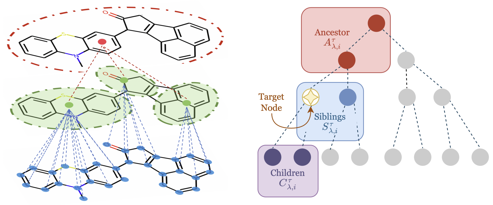

# Scalable Hierarchical Self-Attention with Learnable Hierarchy for Long-Range Interactions

Published at Transactions on Machine Learning Research (TMLR): https://openreview.net/pdf?id=qH4YFMyhce (forum: https://openreview.net/forum?id=qH4YFMyhce)



## Project directory structure
The details of command to run the code are provided in sub-folders:
```text
HierAttention/
├── graph
├── lra
├── point_cloud
```

## Environment setups

Follow these commands below:
```
conda create --name sequoia python=3.7
conda activate sequoia

conda install pytorch=1.11 cudatoolkit=11.3 -c pytorch

conda install pyg=2.0.3 -c pyg
```

## Please cite our paper as follows!

```bibtex

@article{
trang2024scalable,
title={Scalable Hierarchical Self-Attention with Learnable Hierarchy for Long-Range Interactions},
author={Thuan Nguyen Anh Trang and Khang Nhat Ngo and Hugo Sonnery and Thieu Vo and Siamak Ravanbakhsh and Truong Son Hy},
journal={Transactions on Machine Learning Research},
issn={2835-8856},
year={2024},
url={https://openreview.net/forum?id=qH4YFMyhce},
note={}
}
```
